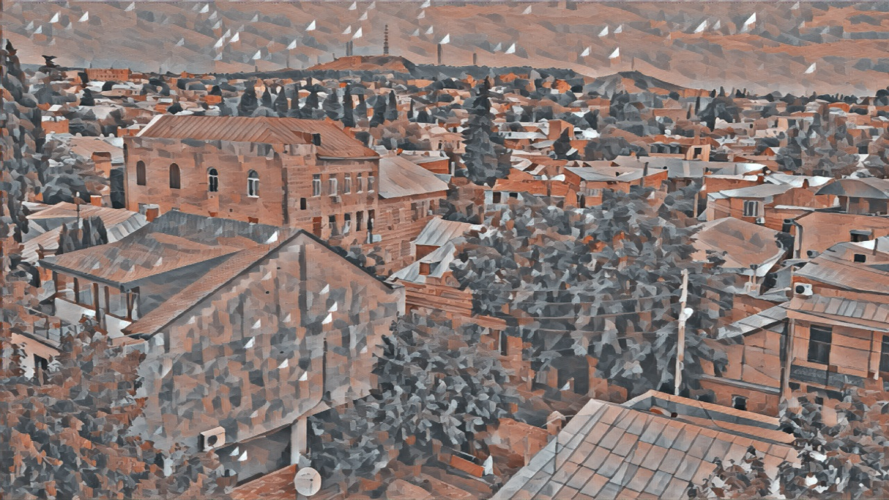

# Style-Transfer-Open-CV

## Video

## High Res Still

This is a simple example of how to run a Neural Net on a live video stream with Open CV using OpenVinoToolkit.

Using styles from my [Realtime Style Transfer Project](https://github.com/NeuralVFX/real-time-style-transfer), I've converted the pytorch model to `ONNX`, and then converted that to OpenVino optimized `BIN`+`XML`

Testing this on my Microsoft Surface, at 256x256, I get about 30fps.

In order for the EXE to run, run this OpenVino script first: `C:\Program Files (x86)\IntelSWTools\openvino\bin>setupvars.bat`

## Requirements
- Install [OpinVinoToolkit] (https://01.org/openvinotoolkit)
- Requires Intel Graphics Card to run in OPENCL mode
